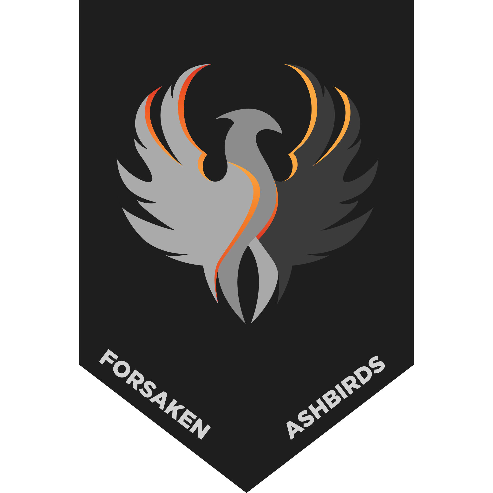

# Gaming-Clan Style und Design Guide

## 1. Clan-Name und Logo

### 1.1 Clan-Name

Unser Clan-Name ist Forsaken Ashbirds. Als Clan Tag sind die Buchstaben [FAB] zu verwenden. Der Name sollte in allen offiziellen Dokumenten und Kommunikationen verwendet werden, um eine einheitliche Identität zu gewährleisten. Der Clan-Name sollte in Großbuchstaben geschrieben werden, um die Lesbarkeit zu verbessern und die Marke zu stärken.

### 1.2 Logo

Unser offizielles Clan-Logo ist:

</img>

## 2. Farbpalette

Unsere offizielle Farbpalette besteht aus folgenden Farben:

- Hauptfarbe:  `#8C8C8C`
- Sekundärfarbe:  `#AAAAAA`
- Terziärfarbe:  `#3B3B3B`
- Akzentfarbe 1:  `#F89939`
- Akzentfarbe 2:  `#DD3926`
- Hintergrundfarbe:  `#1E1E1E`
- Textfarbe:  `#D3D3D3`

## 3. Schriftarten

Unsere offiziellen Schriftarten sind:

- Überschriften: FracturaND
- Fließtext: Roboto

## 4. Logo-Verwendung

Unser Logo sollte in den folgenden Formaten verwendet werden:

- Vollständiges Logo (mit Text)
- 3D-Logo

## 5. Design-Richtlinien

### 5.1 Allgemeine Gestaltungsprinzipien

- Minimalistisches Design bevorzugen.
- Klarheit und Lesbarkeit sind wichtig.
- Orientierung an der Aschevogel-Thematik. Das Design sollte Elemente enthalten, die mit Asche, Feuer, Rauch und Söldnern in Verbindung stehen.

### 5.2 Verwendung des Logos

- Das Logo sollte immer in angemessener Größe und Proportion verwendet werden.
- Vermeidung von Verzerrungen oder unscharfen Vergrößerungen.

### 5.3 Typografie

- Große, gut lesbare Schriftarten für Überschriften.
- Konsistente Verwendung von Schriftgrößen und -stilen für Fließtexte.

### 5.4 Grafikelemente

- Verwendung von Grafikelementen, die dem Gaming-Thema entsprechen.
- Zurückhaltender Einsatz von Effekten wie Schatten und Glanz. (Ausgenommen 3D-Logo und Effekte, die dem Thema entsprechen)

## 6. Anwendungsbeispiele

### 6.1 Social-Media-Profile

- Verwendung des Logos als Profilbild.
  - Hierfür gibt es in Logo Source File eine Vorlage. Diese enthält das Logo, den Spielernamen und den Rang.
- Verwendung der offiziellen Farbpalette für Hintergründe und Texte.

### 6.2 Clan-Website

- Einbindung des Logos in das Website-Header.
- Verwendung der offiziellen Schriftarten für Texte.
